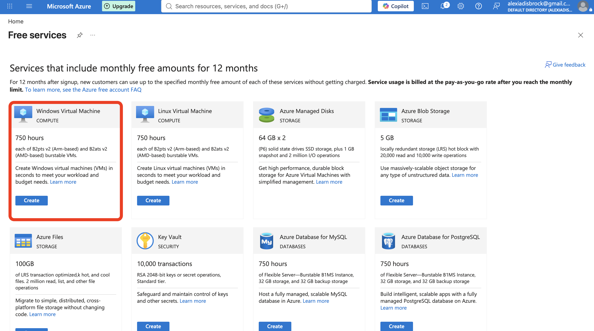
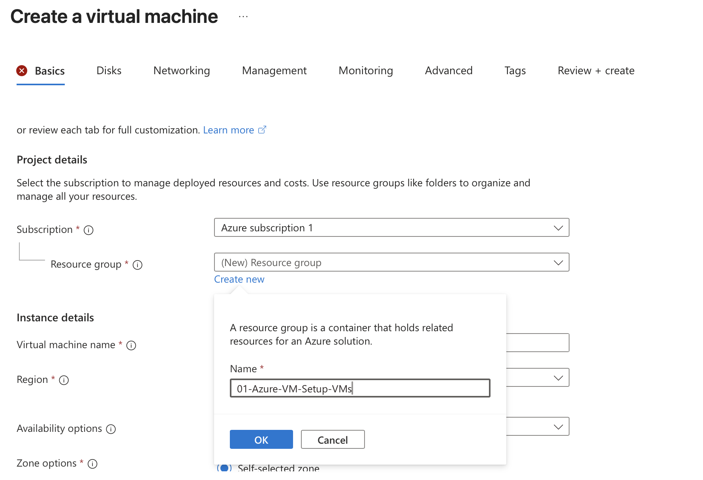
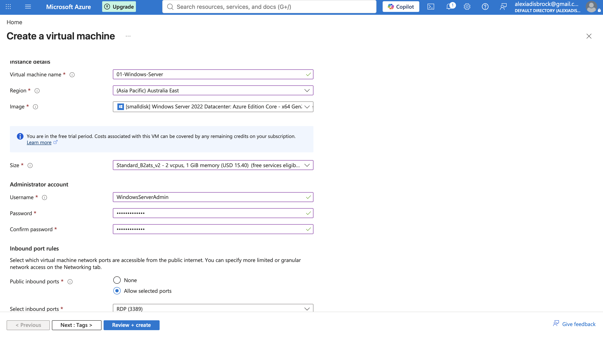
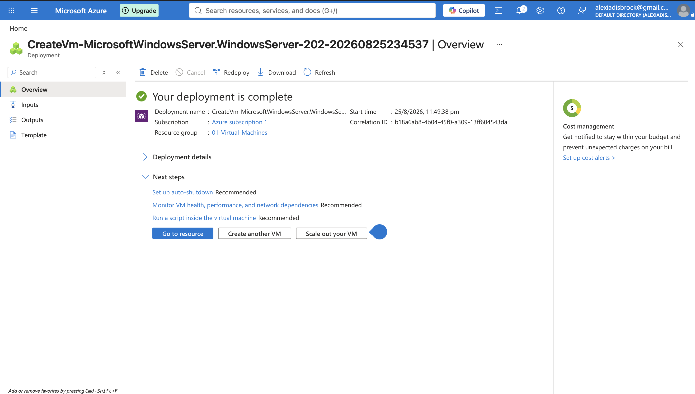

# Project 01: Deploying a Windows Server Virtual Machine in Microsoft Azure

## Objective
Deploy a Windows Server virtual machine in Microsoft Azure, configure secure remote access, and document the process end-to-end. 

Goal: build hands-on familiarity with Azure's VM provisioning workflow and basic network security controls.

## Tools & Technologies
- Microsoft Azure (Free Tier)
- Azure Virtual Machines
- Windows App for MacOS
- Network Security Groups (NSG)
- Remote Desktop Protocol (RDP)

## Steps Taken

### 1. Create VM
Begin the VM creation process: Search bar -> Free Services -> Windows Virtual Machine -> Create

### 2. Created a Resource Group
Set up a dedicated resource group (`01-Virtual-Machines`) to keep all resources for this project organised and easy to tear down afterward.

### 3. Provisioned the Virtual Machine
Named the VM (`01-Windows-Server-VM`), Selected a Windows Server 2022 image, set region to 'Australia East', chose the standard B2 (free-tier eligible) size, and configured the admin username/password, left default port open for future use.

### 3. Connect via Remote Desktop
By default, Azure opens RDP (port 3389) to the whole internet meaning any machine can connect to it. I tested this by downloading the RDP file from the Azure Portal and using the Windows App for MacOS with the credentials set during provisioning.

### 3. Configured the Network Security Group
Because RDP (port 3389) is open to the whole internet, this opens a security risk. I edited the inbound rule to restrict RDP access to my home IP address only. Networking -> Network Settings -> Rules -> RDP -> Changed 'Source IP' from 'Any' to 'My IP Address'

### 4. Retry Connection
Attempted connection from 2 different machines: 1 with the authorised IP address and 1 without to test that the NSG rules functioned correctly.

## Challenges & Troubleshooting
- Was unable to select VM size - after some research identified that some services were not available in my region therefore i selected a compatible service
- Assumed the 'My IP Address' option in the NSG Rules would restrict to a single device, however, testing from multiple devices on the same home network revealed the rule is based on the networks public IP address via NAT (1 public facing IP address for all devices on the same home network), not per device. Confirmed this by testing from a device on mobile data which was correctly blocked. 

## Outcome
Successfully deployed and secured a cloud VM, and gained a working understanding of how Azure handles resource grouping, VM provisioning, and network-level access control via NSGs.

## What I'd Do Next
- Automate this deployment using Azure CLI or an ARM/Bicep template instead of the portal UI
- Set up Azure Monitor/alerts on the VM
