# Project 02: Active Directory Domain setup in Microsoft Azure

## Objective
Deploy a Windows Server as an Active Directory Domain Controller, join a client machine to the domain, create and manage user accounts within an Organisational Unit, and apply a Group Policy to confirm centralised policy enforcement. Also test a password reset

## Tools & Technologies
- Microsoft Azure
- Azure Virtual Machines
- Windows Server 2022
- Windows 11 Pro
- Group Policy Management
- Active Directory Domain Controller
- Remote Desktop Protocol (RDP)

## Steps Taken

### 1. Created a Resource Group
Set up a dedicated resource group (`02-active-directory`) for both the VMs i will create.

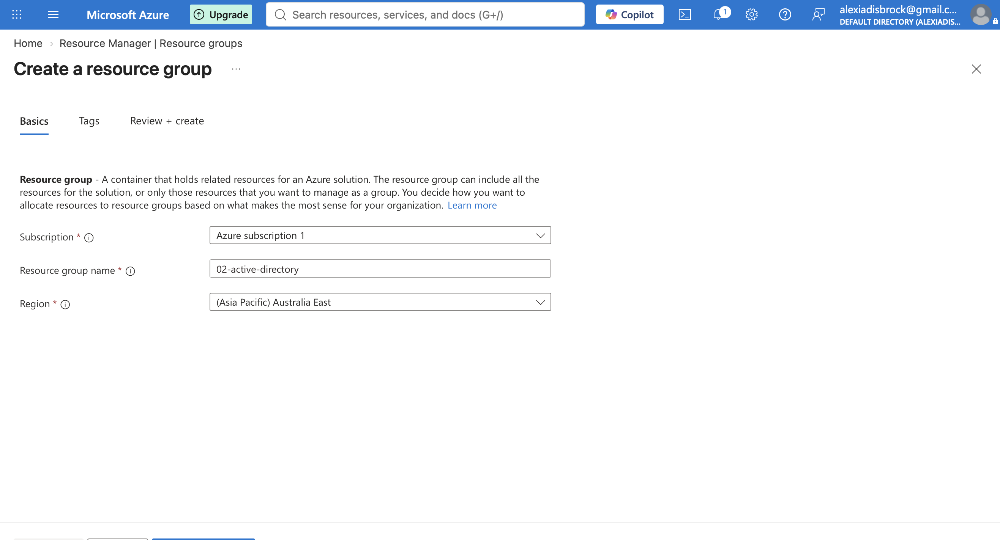

### 2. Created Virtual Network
Set up a VNet (`02-ad-vnet`) to seperate these VMs from others through the Virtual Networks page rather than inline during VM creation.

### 3. Created Domain Controller VM
Set up a Windows Server 2022 VM (`dc-01`) within the new resource group with B2ats size. In Networking selected our (`02-ad-vnet`) virtual network.

### 4. Created Client VM on same Network
Deployed a Windows 11 client VM (`client-01`) inside the same resource group (`02-active-directory`) and within the same VNet (`02-ad-vnet`) so the two VMs can communicate.

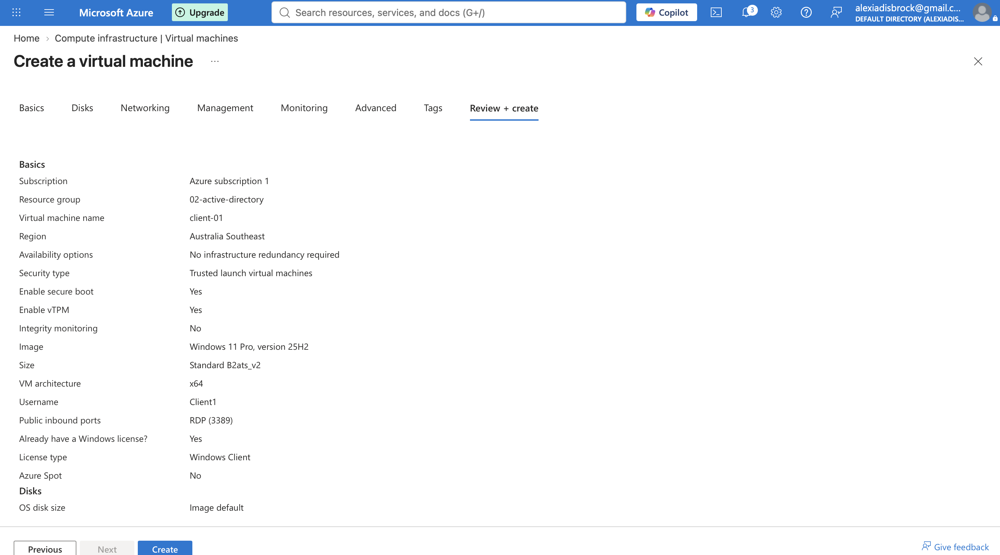

### 5. Install Active Directory Domain Services on dc-01
Installed the AD DS role via Server Manager on `dc-01`. This only installs the AD software itself it makes it possible to become a domain controller, the server isn't actually functioning as a one yet

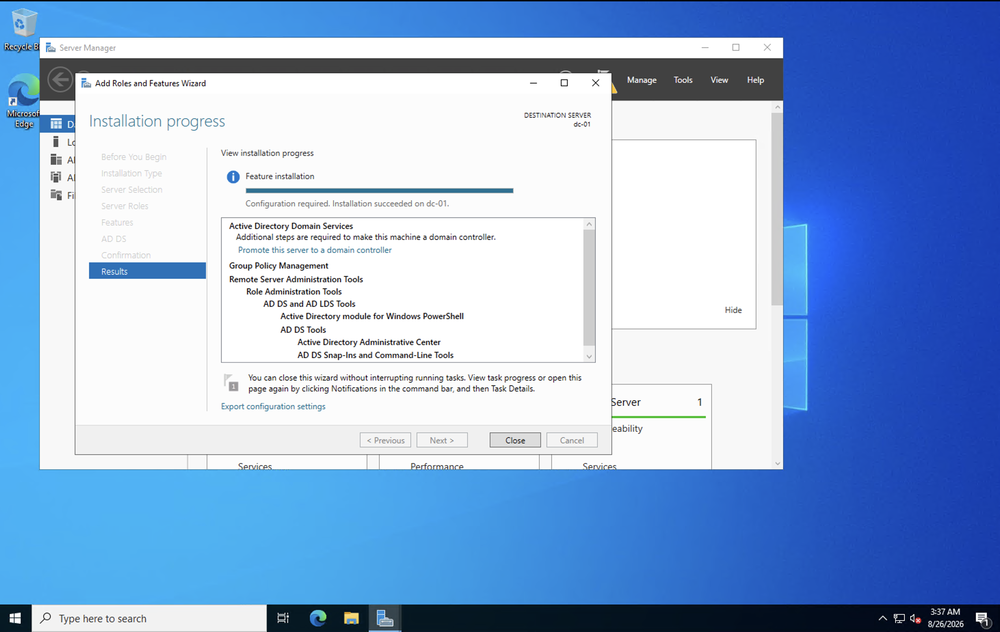

### 6. Promote dc-01 to Domain Controller
Ran the AD DS Configuration Wizard and added a new forest (`activedirectory.local`). This is what actually activates AD, it builds the AD database, creates the domain, and converts `dc-01` from a standalone server into a functioning domain controller. It also automatically installs the DNS Server role on `dc-01` since AD depends on DNS to advertise itself to other machines on the network.

### 7. Point VNet's DNS to dc-01
By default `02-ad-vnet` used Azure's own DNS servers, which have no knowledge of the `activedirectory.local` domain I'd just created. I changed the VNet's DNS setting from default to custom, pointing it at `dc-01`'s private IP. Without this `client-01` would have no way to find the domain.

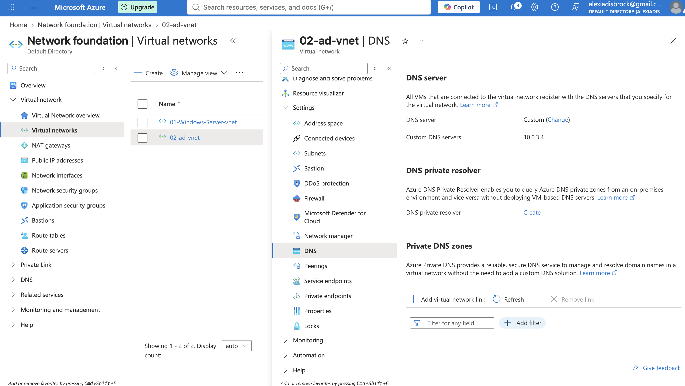

### 8. Join `client-01` to the Domain
On `client-01` I went to System Properties -> Change -> Domain, and entered `activedirectory.local`.

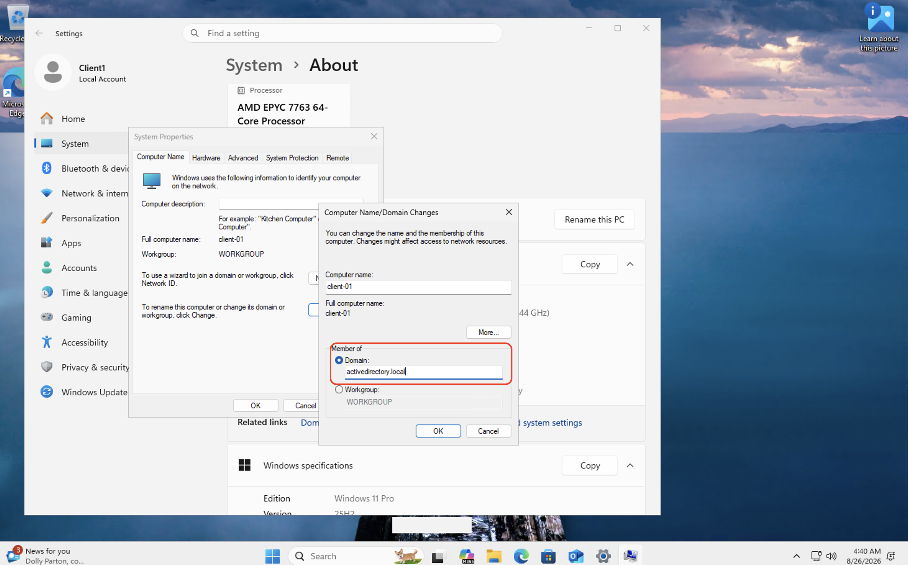

Authenticated with domain admin credentials to complete the join.

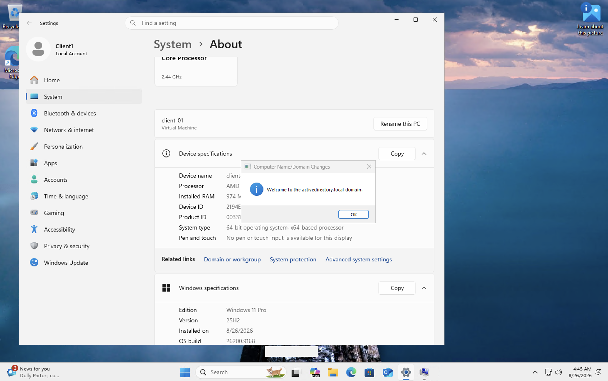

After the required restart I re-checked System Properties to confirm the domain now shows as `activedirectory.local` instead of a workgroup.

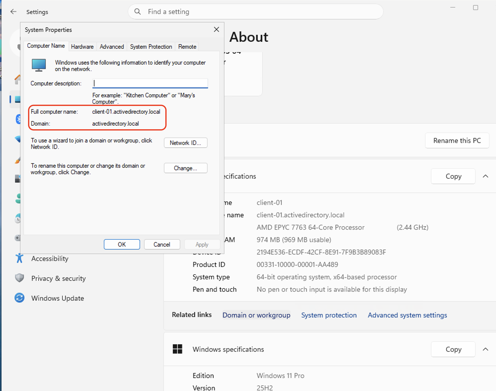

### 9. Create Organisational Unit (OU) and Test User
On `dc-01` I created an OU called "IT Department" in Active Directory Users and Computers, then created a test user inside it. Using an OU rather than creating the user in the domain root reflects how AD is structured in real environments as OUs are what let admins apply different policies to a group of users instead of 1 at a time.

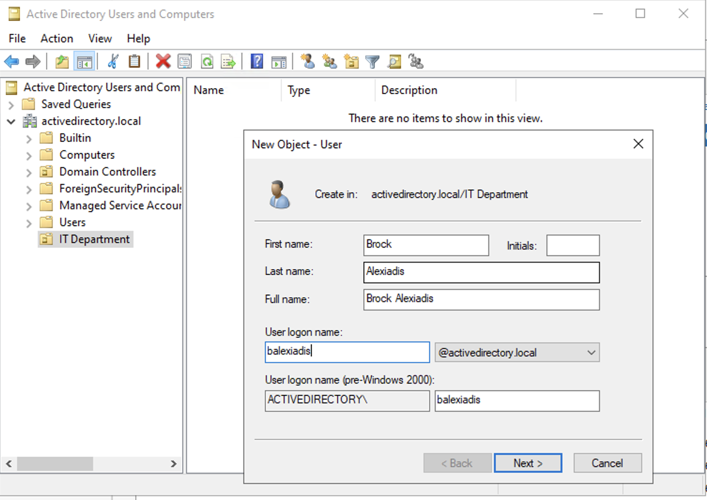

### 10. Test New User 
Logged into `client-01` with the new domain account to confirm authentication was actually working

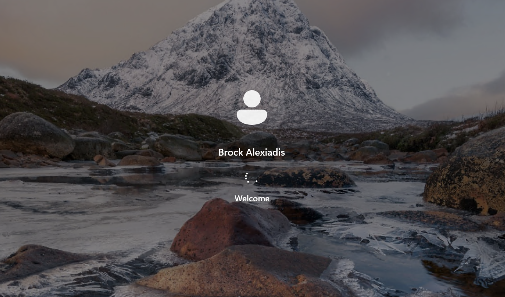

### 11. Add a Group Policy
To demonstrate centralised policy enforcement I created a GPO to push a custom desktop wallpaper to domain users

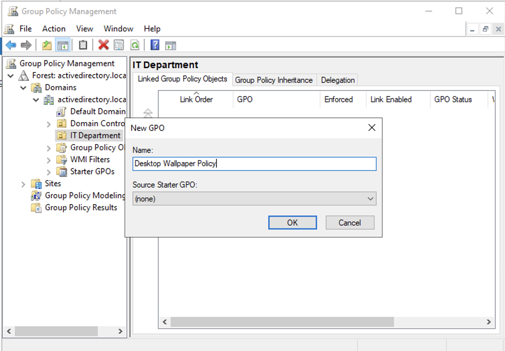

Enabled the Desktop Wallpaper GPO and pointed it to the share folder with the desired wallpaper.

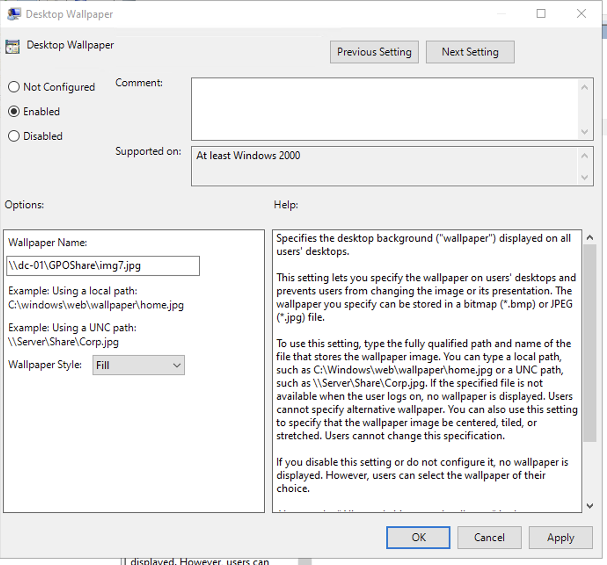

Forced Group Policy update on `client-01` logged in on my user account.

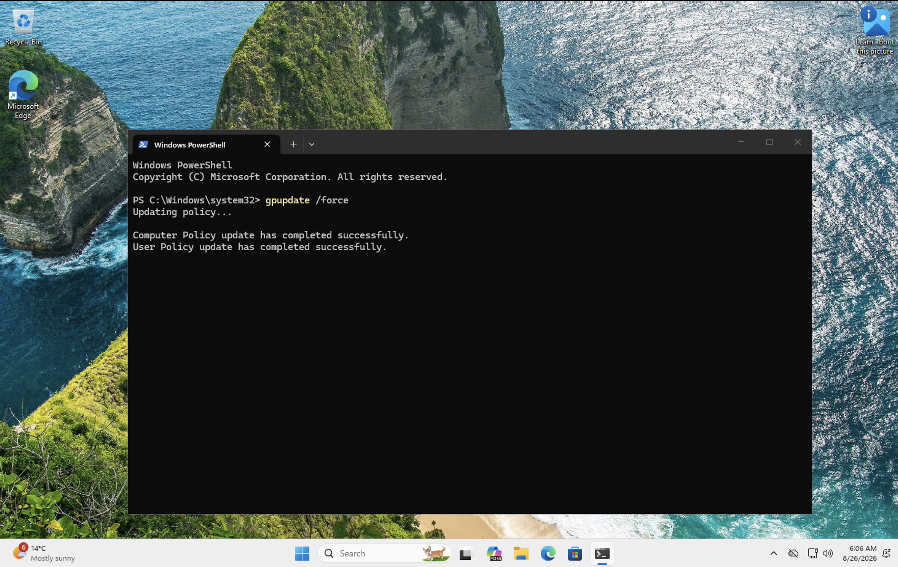

Restarted the machine to see the correct Wallpaper.

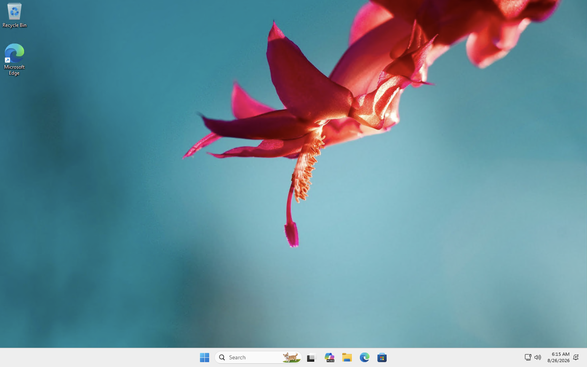

## How to Password Reset
Find the User needing password reset in "Active Directory Users and Computers" -> Right-Click -> Reset Password

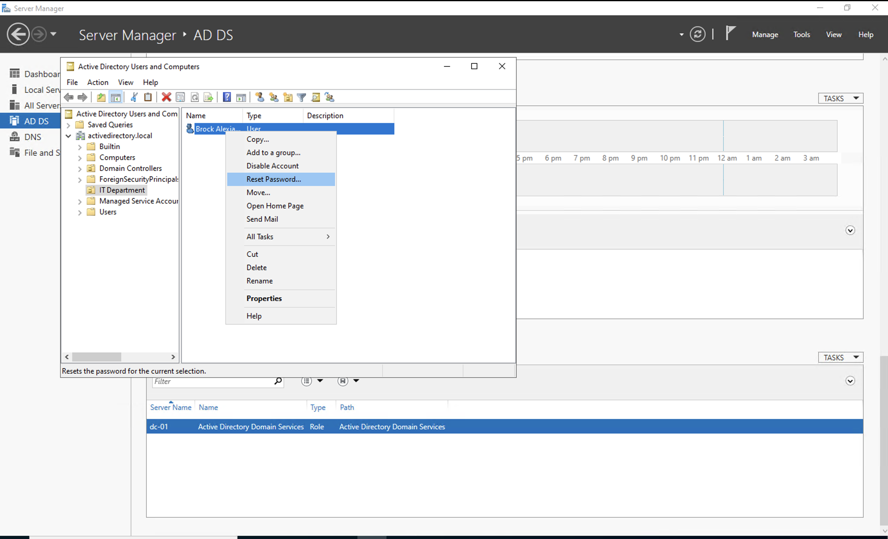

## Challenges & Troubleshooting
- VM deployment failed with `ResourceNotFound` error because the VNet i had created during the VM provisioning had not finished deploying before my (`dc-01`) VM had tried to connect to it. Fixed this by creating the VNet in a standalone step from the Virtual Networks page.
- Login via RDP failed when the "User must change password at next Logon" setting was enabled because RDP doesn't have an interactive UI to complete the change. Since this was just a test account i disabled the option so no password change was required.
- New user couldn't RDP into `client-01` despite being joined to the Domain because RDP access isn't enabled by default. I fixed this by the new user to the local "Remote Desktop Users" group via System Properties -> Remote

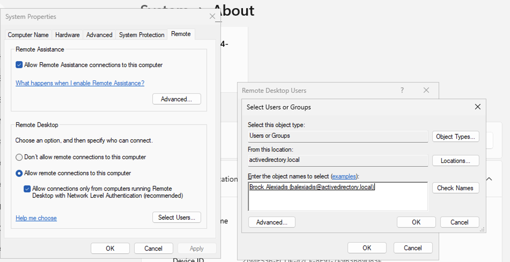

## Outcome
Successfully deployed a functioning Active Directory domain from scratch: created a Domain Controller, configured DNS to support domain resolution, joined a client machine, created and tested a domain user account, and applied Group Policy across the domain.

## What I'd Do Next
- Apply more advanced Group Policies (software, security, etc)
- Explore setting different password policies instead of one policy for the whole domain
