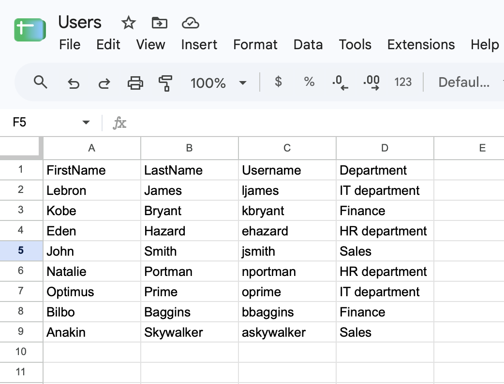
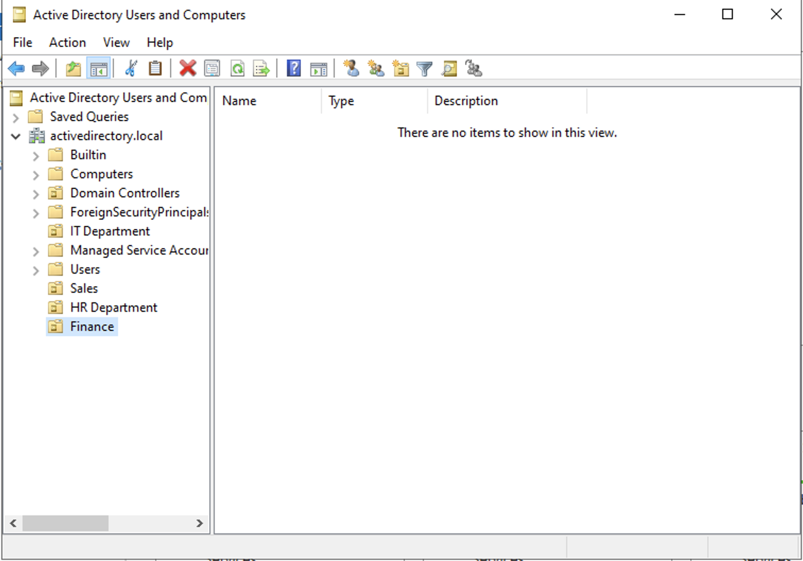
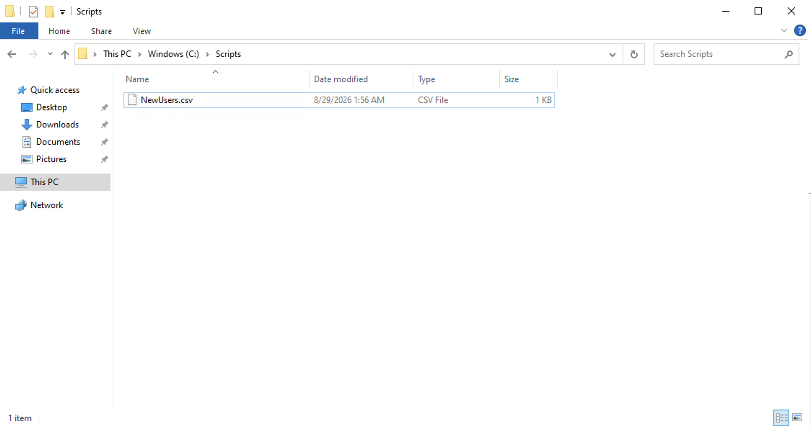
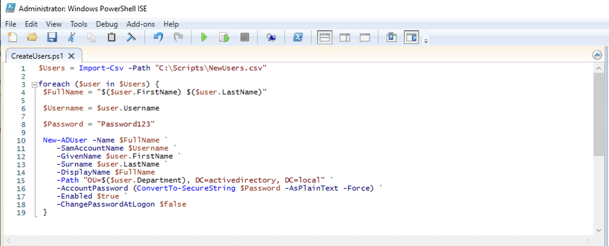
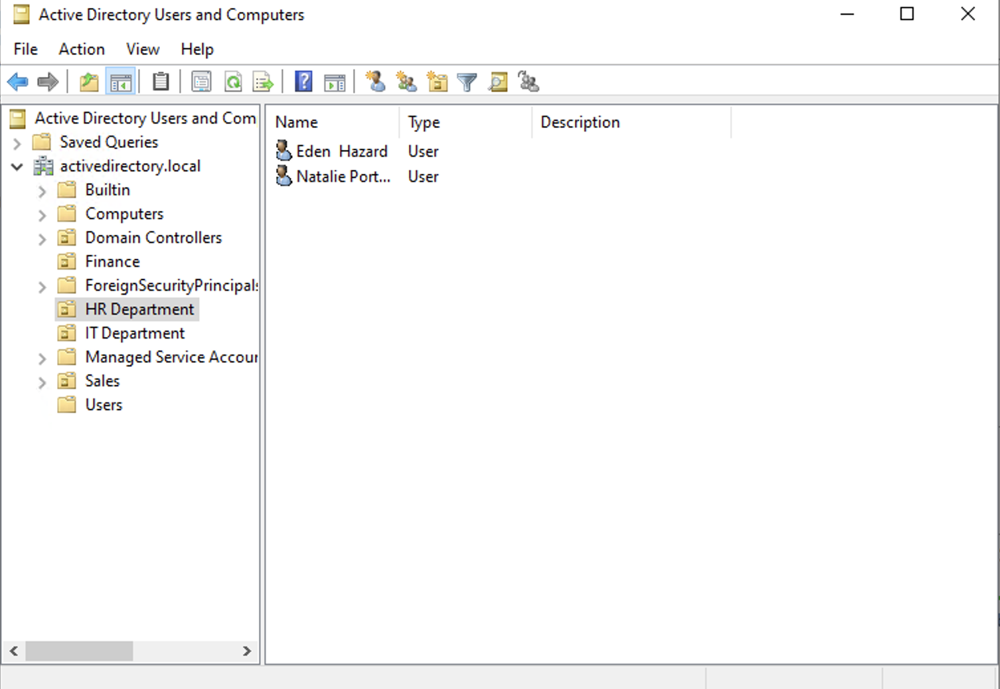
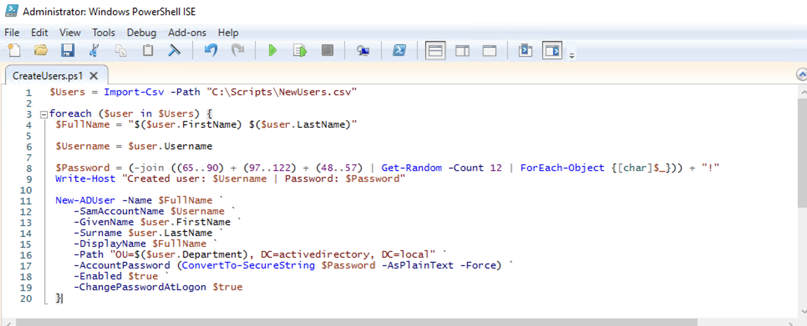
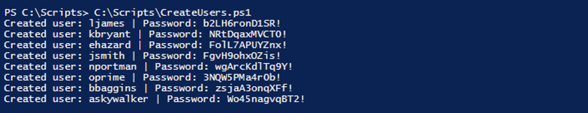

# Project 03: Bulk Active Directory User Creation via PowerShell

## Objective
Write a PowerShell script to automate the creation of multiple Active Directory user accounts from a CSV file, placing each user into the correct Organisational Unit based on their department. Extends the manual AD user creation process from Project 02 into a repeatable, scriptable workflow reflecting a real-world onboarding scenario where IT needs to provision several accounts at once rather than one at a time.

## Tools & Technologies
- Microsoft Azure
- PowerShell
- CSV
- AD DS
- Windows Server 2022

## Steps Taken

### 1. Create the CSV 
Create a CSV file via Google Sheets with the users first name, last name, username, and department in each column.

### 2. Set up Organisational Units
Create OUs for corresponding departments in the CSV to ensure new users can be automatically sorted into them. 

### 3. Transfer the CSV onto `dc-01` VM
Create a `Scripts` folder on the `dc-01` Virtual Machine to store the CSV so that our AD DS has access to it. Path is `C:\Scripts\NewUsers.csv`

### 4. Write a Basic Script for Importing New Users from the CSV
Use Import-CSV to load our `NewUsers.csv` into a variable, use a for loop and `New-ADUser` to map the columns from the CSV to the parameters required for creating a new user in Active Directory.

NOTE: using a simple password for testing purposes with Change Password on Logon set to false to avoid issues with the Windows RDP App

### 5. Run script and Verify User Creation
Run script from PowerShell and check Active Directory Users and Computers (ADUC) to ensure users are created and placed in the correct OU's.

Example: HR Department

### 5. Implement Random Password Generation
Once verified the script works, we should change the script to create a random password for each users when they are created for security reasons.

Takes uppercase, lowercase, and numbers and picks a random combination of 12. Then prints them to the shell so admin can take note and give them to each user.

## Outcome
Successfully scripted the automatic creation of Active Directory users, placed them in the correct OU, and set up unique password creation for each user.

## What I'd Do Next
- Export generated usernames and passwords to a CSV or secure file instead of only displaying them in the console, better reflecting how a real onboarding workflow would hand off credentials
- Add validation to check whether a target OU exists before attempting to create a user, with a clear error message if it doesn't
- Extend the script using PowerShell Remoting to also grant baseline access (e.g. Remote Desktop Users group membership) on the client machine for roles requiring remote access, rather than handling it as a manual follow-up step
