# Project 04: Standalone DNS Server & Zone Configuration

## Objective
Deploy a standalone Windows Server DNS role in an isolated Azure environment and configured a custom DNS zone with multiple record types (A, CNAME, MX, TXT), along with forwarding to resolve external domains.

## Tools & Technologies
- Microsoft Azure
- Azure Virtual Machines
- Windows Server
- DNS Server Role
- RDP

## Steps Taken

### 1. Create Resource Group, VNet, and Virtual Machine
Set up a dedicated resource group (`04-dns-server`) to keep all resources for this project organized. Within this resource group, create a VNet (`04-dns-vnet`), and Windows Server 2022 Virtual Machine (`dns-01`).

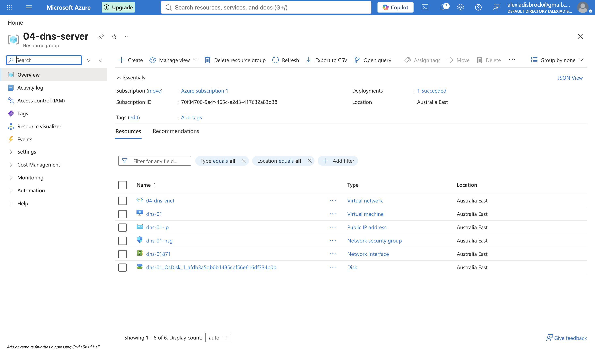

### 2. Ensure DNS server VM (`dns-01`) has a Static IP
DNS clients need a reliable, unchanging address to send their lookup requests to. If the DNS server's address shifts after a reboot, every client configured to use it would suddenly be pointing at nothing.

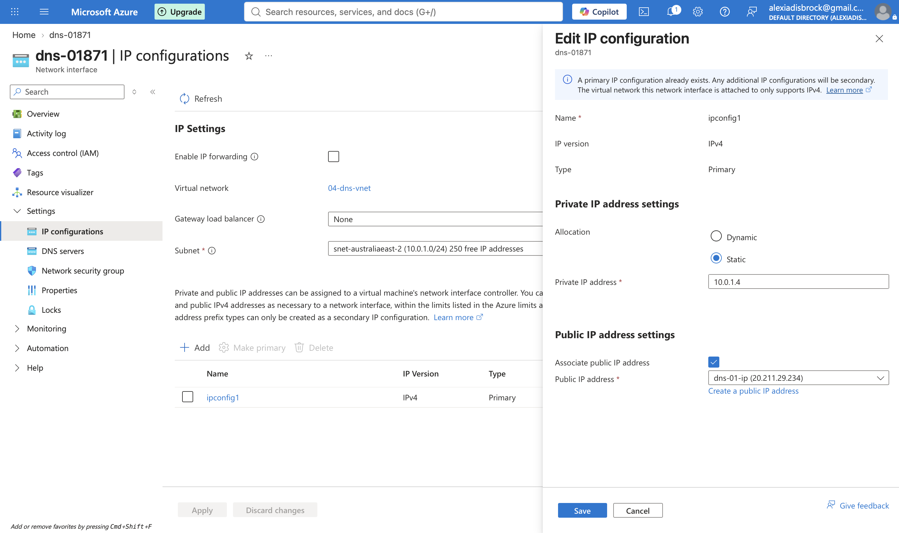

### 3. Add DNS Server Role
In Server Manager add the DNS Server Role

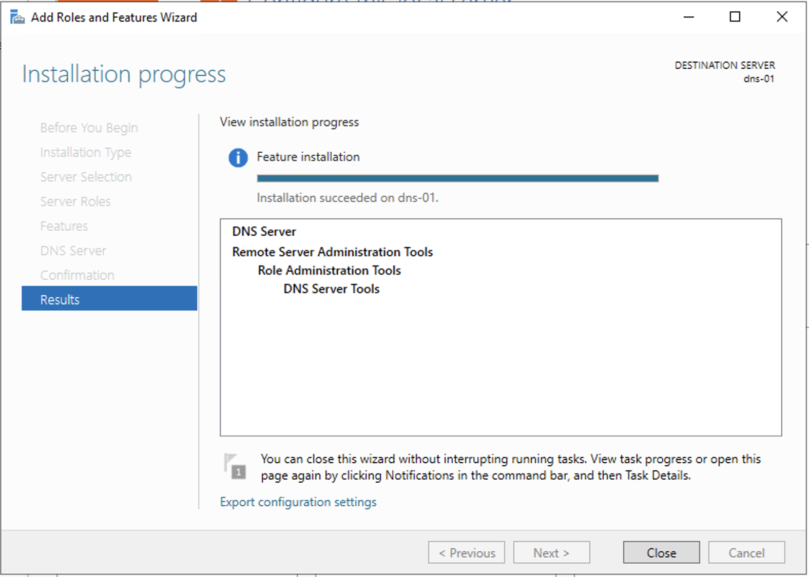

### 4. Create Forward Lookup Zone
Created a new Primary Forward Lookup Zone (`mydns.local`) establishing `dns-01` as the authoritative server responsible for resolving names under that domain.

*As i will be manually creating records 'dynamic updates' will be disabled

-Forward Lookup Zone: converts human readable domains to ip's

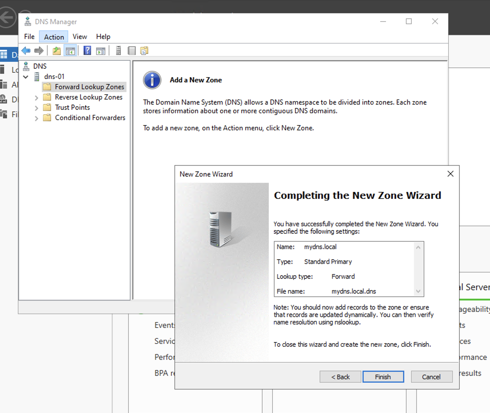

### 5. Create 'A' Record
Created a Host (A) record called `testserver`, mapped it to a test private IP (`10.0.1.67`). 

This is the most fundamental DNS record type as it maps a domain name directly to an IP, and the building block every other record type in this project relies on.

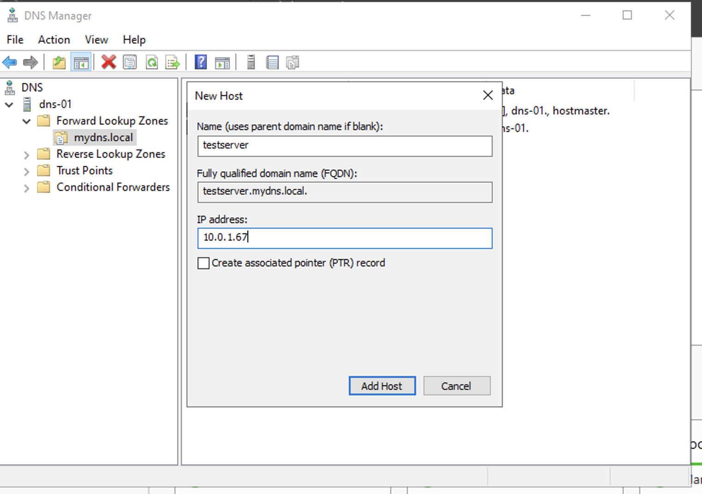

### 6. Create CNAME Record
Created an Alias (CNAME) record named `server1` pointing to the `testserver` A record. Rather than duplicating the same IP under a second name, a CNAME points to the main 'A' record which then points to the IP.

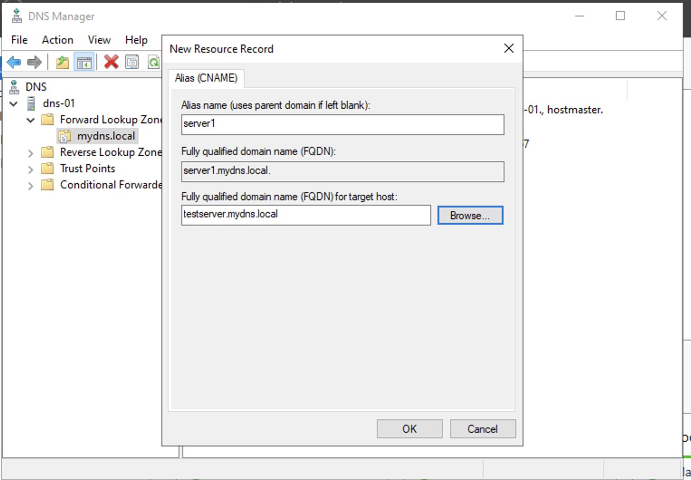

### 7. Create MX Record
Created a Mail Exchanger (MX) record pointing to `mail.mydns.local`. 

I learnt that MX records point to a hostname rather than directly to an IP meaning a separate A record is required for that hostname to actually resolve. Therefore I also created an A record named mail pointing to its own test IP, completing the MX-to-A relationship.

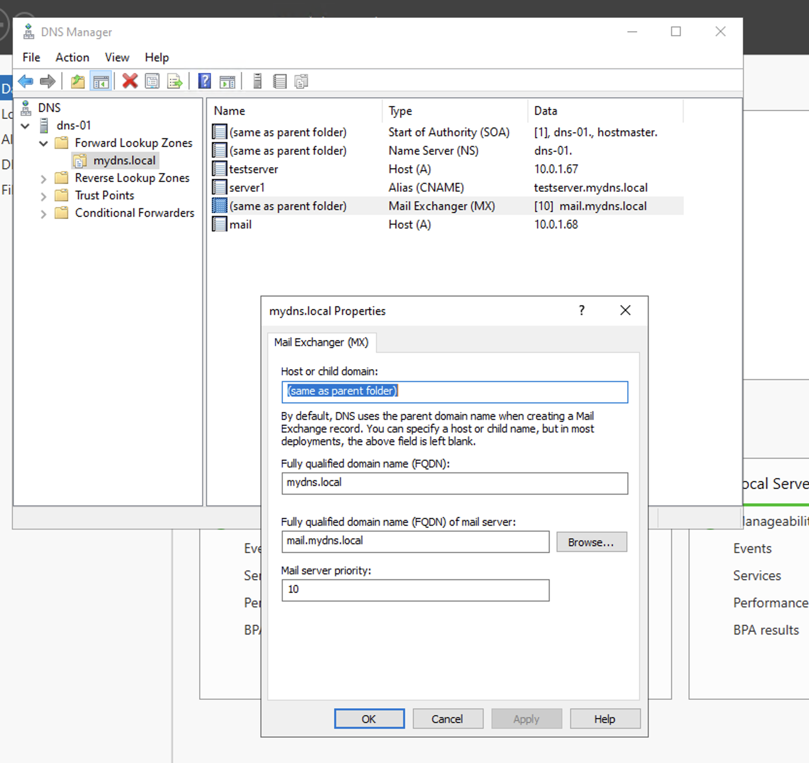

### 8. Create TXT Record
Created a TXT record named `txttest` containing random text.

This shows that DNS isn't limited to just ip address resolution. TXT records are commonly used in the real world for things like email security verification (SPF, DKIM).

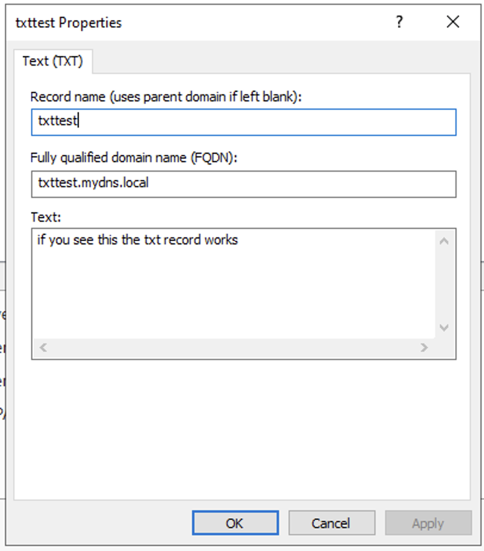

### 9. Verified All Records Worked With `nslookup`
Used `nslookup` from the command line to specifically query `dns-01` for each record type and confirm correct resolution including the CNAME correctly resolving through to its target's IP, and the MX record correctly returning its mail server hostname and preference value.

A Record:

CNAME Record:

MX Record and corresponding A Record:
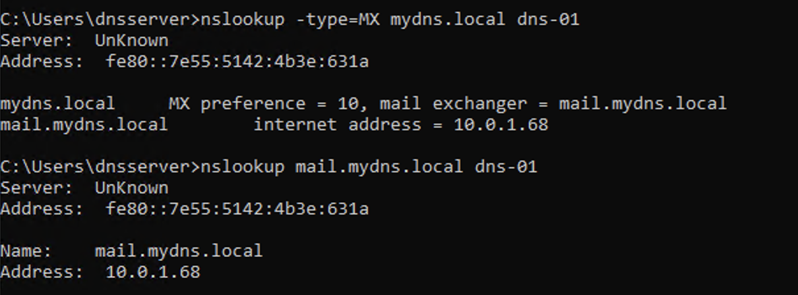

TXT Record:
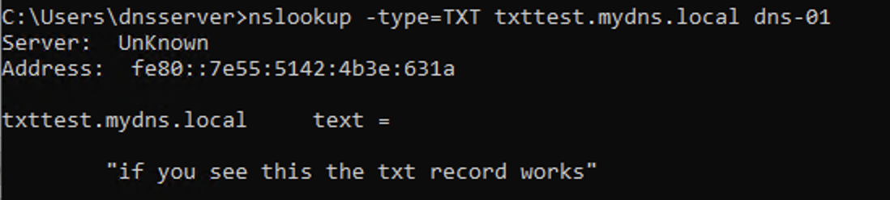

### 10. Configured DNS Forwarding
With how i initially set it up, `dns-01` could only resolve records within its own zone (`mydns.local`). It had no way to answer queries for real internet domains like `google.com`. 

I configured a forwarder pointing to Google's public DNS (`8.8.8.8`) under the server's Forwarders settings, so any query outside dns-01's own zone gets passed along to a server that can actually answer it. 

Verified this by running `nslookup google.com dns-01` and confirming it returned real, valid IP addresses for Google

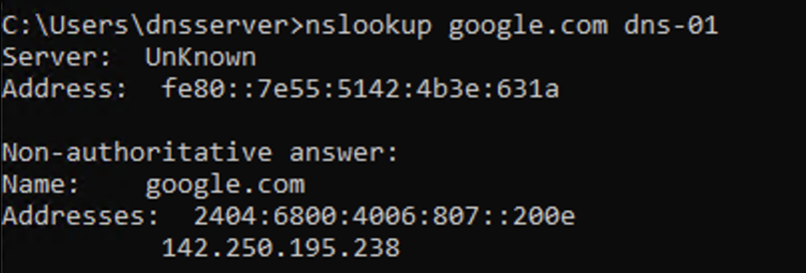

## Outcome
Successfully deployed a standalone DNS server from scratch and configured it with a custom zone containing A, CNAME, MX, and TXT record types. Verified each through direct `nslookup` testing. Also configured forwarding so the server could resolve real-world domains outside its own zone.

## What I'd Do Next
- Set up a secondary DNS server and configure zone transfer replication, to understand DNS redundancy beyond a single point of failure
- Create a Reverse Lookup Zone to resolve IP addresses back to hostnames, the inverse of everything done in this project
- Enable DNS logging/debugging to observe query traffic in real time
- Explore DNSSEC to understand how DNS responses can be cryptographically verified against tampering
