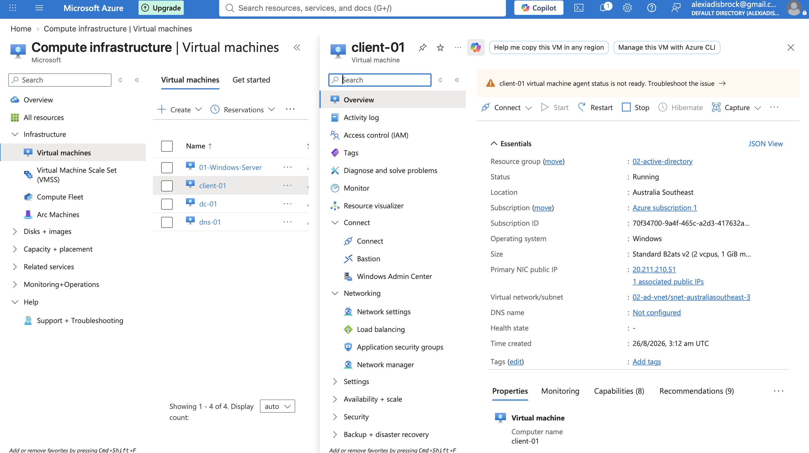
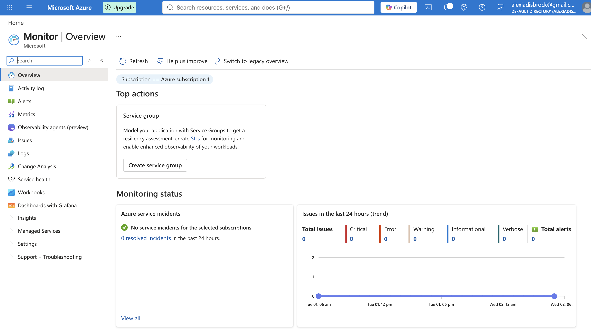
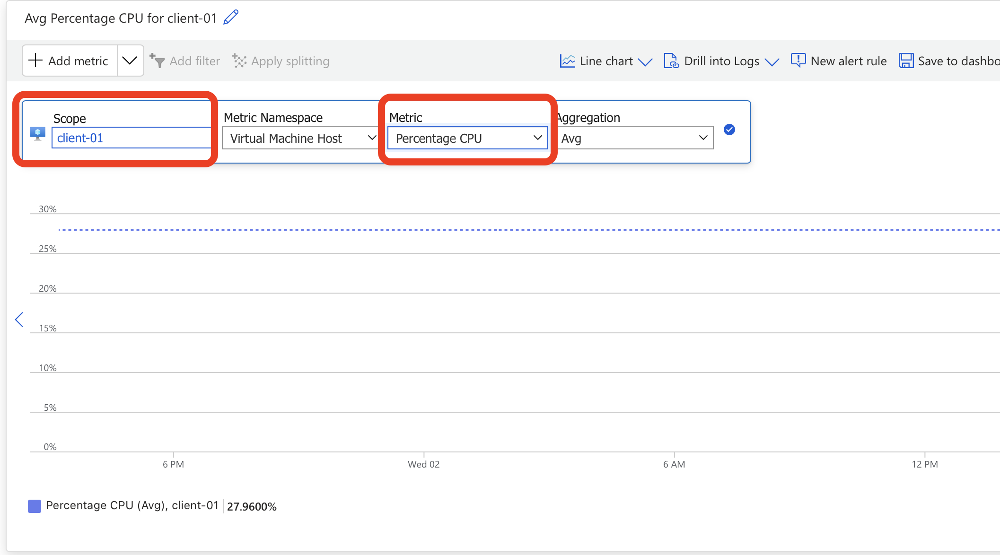
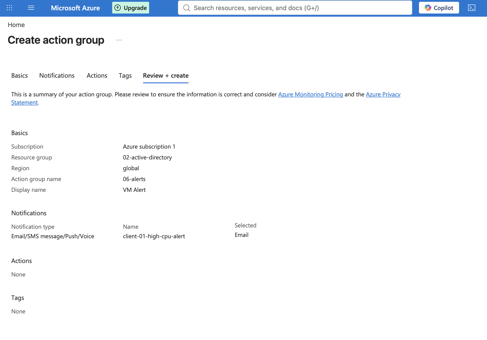
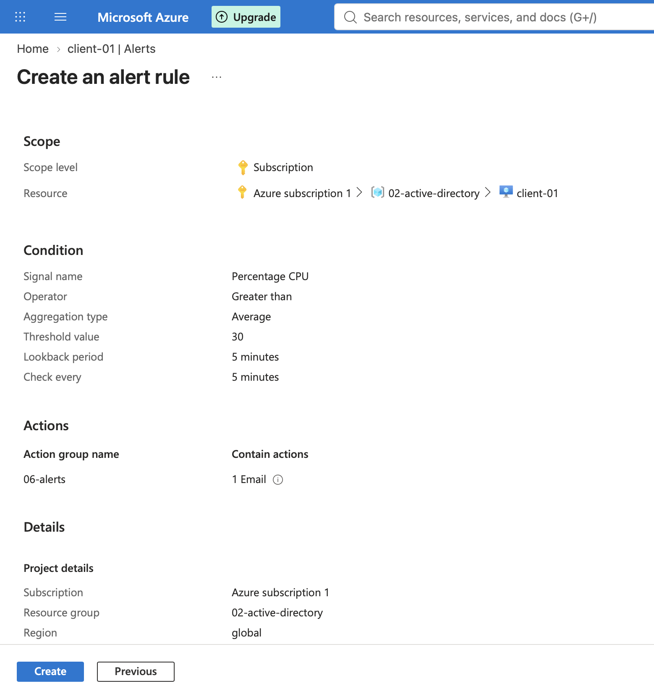
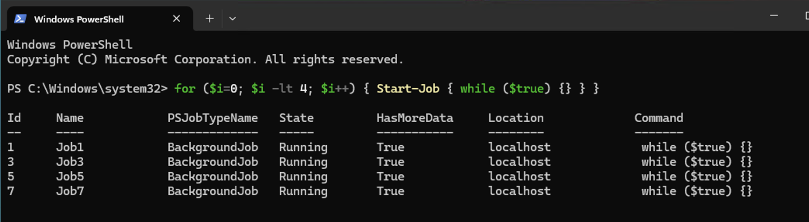
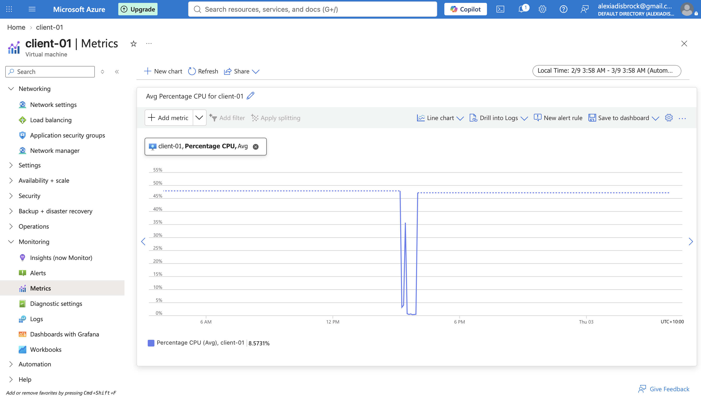
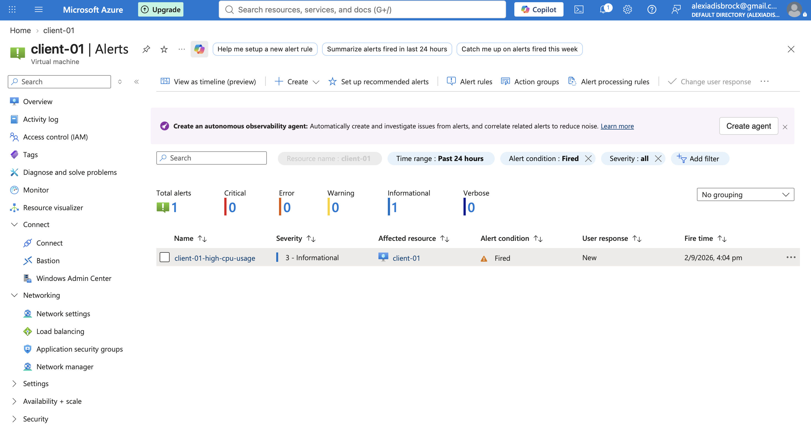
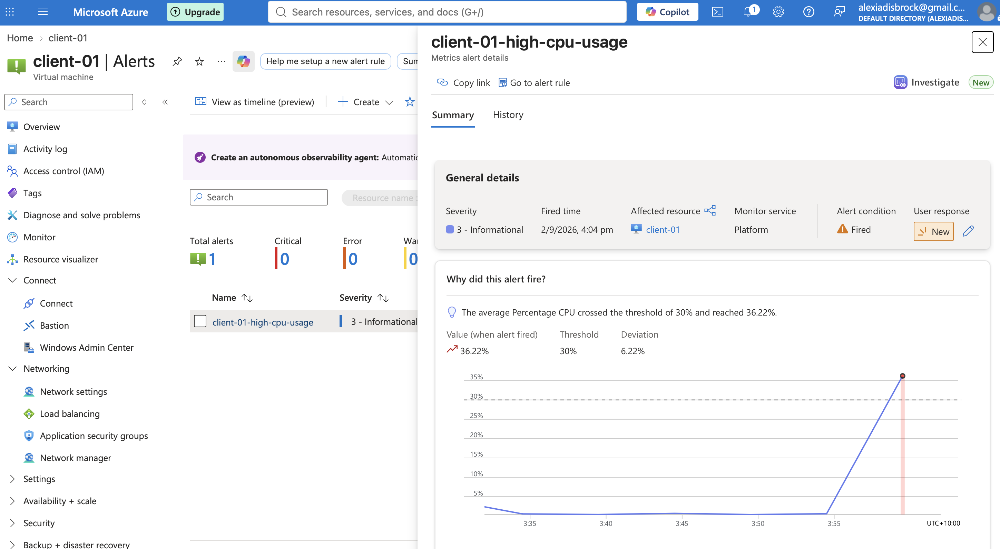
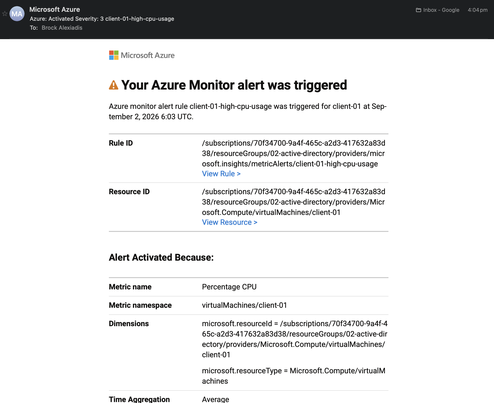

# Project 06: Azure Monitor & Alerting for VM Resource Thresholds
## Objective
Set up Azure Monitor and alerting on an existing Virtual Machine so that when a condition is met/exceeded the admin is automatically notified. Test this by intentionally spiking the resources of the VM

## Tools & Technologies
- Microsoft Azure 
- Azure Monitor
- Azure Alerts & Action Groups

## Steps Taken

### 1. Start VM
I used a previously configured Windows 11 client VM (`client-01`) for this demonstration as it has no other system/services depending on it. If i used another with AD DS or some other service  on it, intentionally spiking the resources could be risky.

### 2. Understand Monitoring & Metrics
Navigate to Azure Monitor > Metrics and select the scope as `client-01' and metric as 'Percentage CPU'. This shows real time graph of how much cpu is being used by the virtual machine.

### 3. Create Action Group
Navigate to Alerts > Action Groups > Create. This is where we specify who gets alerted when an alert is fired. I named the group `06-alerts` and specified my own email address to be notified when it is sent.

### 4. Create an Alert Rule
The alert rule detects when a problem happens, for this task I set it to be when the percent of cpu usage goes above 30% through Alerts > Alert Rules > Create.

During creation i placed this alert rule within the Action Group we made (`06-alerts`) so i will be notified via email.

### 5. Intentionally Overload CPU
After RDPing into `client-01` i used a simple powershell command to create and run processes in the background to push the cpu over 30%

### 5. Monitoring Spike In Real-Time
On the metrics page with the scope and metric we set (client-01 and percentage cpu) we can see the effect in real time. the cpu usage went from less than 5% before running the script, to over 30% after running it.

### 6. Confirm The Alert Fired In Azure
Through the VM's alert page itself or the general Azure Monitor alert page we can see that now there is 1 total alert with the name we set (`client-01-high-cpu-usage`). 

Clicking into it shows that the alert fired because the cpu usage went over 30% to 36.22% when the alert was fired.

### 7. Verifying Email Notification
Checked my email and confirmed i received the automated notification from Microsoft Azure showing the alert rule `client-01-high-cpu-usage` was triggered for `client-01`, including the rule ID, resource ID, metric name, and time.

## Outcome
Successfully set up Azure Monitoring and alerts so that when a threshold was exceeded not only did it appear in azure monitor but an automated email was also sent to the administrator (me).

## What I'd Do Next
- Explore Log Analytics for deeper log analysis of the alerts beyond the simple metric thresholds
- Build a simple Azure Dashboard and combine multiple metrics from different VM's for easy viewing.
