# Project 08: Kali Linux & Metasploitable 2 Exploitation

## Objective
Use tools available within Kali Linux to scan and identify vulnerabilities in a Metasploitable2 VM. Then exploit these vulnerabilities to gain access to the VM's password hashes, and attempt to crack a hash from the compromised system.

## Tools & Technologies
- Oracle VirtualBox
- Kali Linux
- Metasploitable2
- Nmap
- Metasploit (msfconsole)
- John the Ripper

## Steps Taken

### 1. Set Up Both VMs in VirtualBox
Deployed `Kali Linux` and `Metasploitable2` VM's in VirtualBox

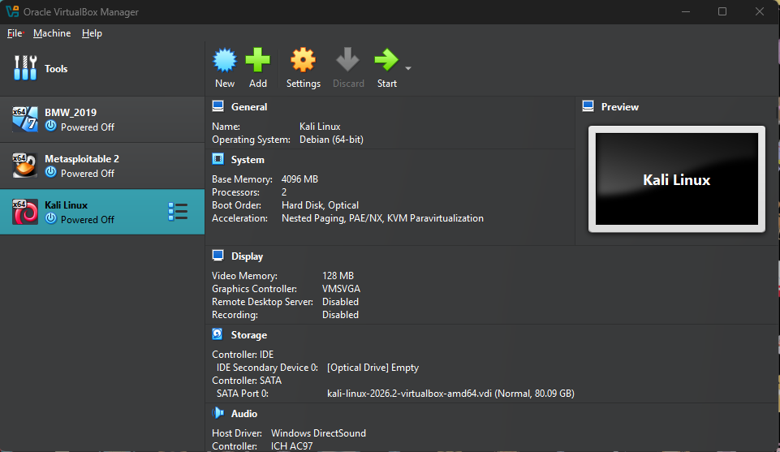

### 2. Isolated Both VMs on the Same Host-Only Network
For security purposes, configured both VMs Network settings to be on the same Host-Only Network to isolate them from the internet and my home network whilst still ensuring they can communicate with each other. 

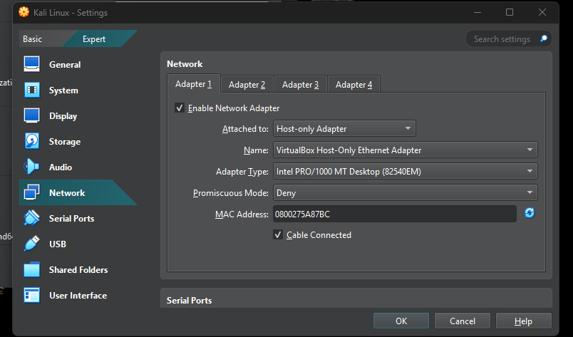

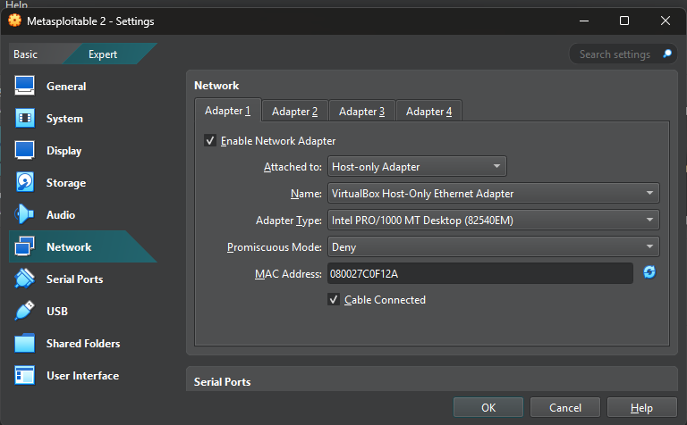

### 3. Verified Connectivity Between The 2 VMs
Identified the Metasploitable VMs IP using `ifconfig` (`192.168.40.3`) then pinged it from the Kali machine to ensure the 2 could communicate with each other over the Host-Only network.

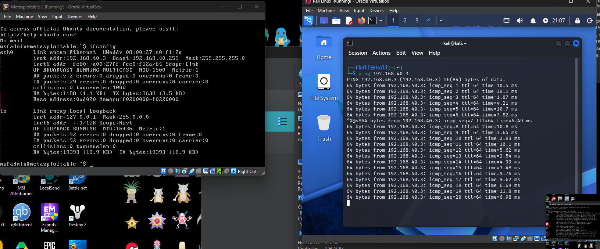

### 4. Scanned the Target using NMAP
On Kali ran `nmap -sV 192.168.40.3` to scan open/vulnerable ports and their versions on the Metasploitable VM which we can then use to attack the machine. Port 21 (ftp) was identified as open so that will be our target.

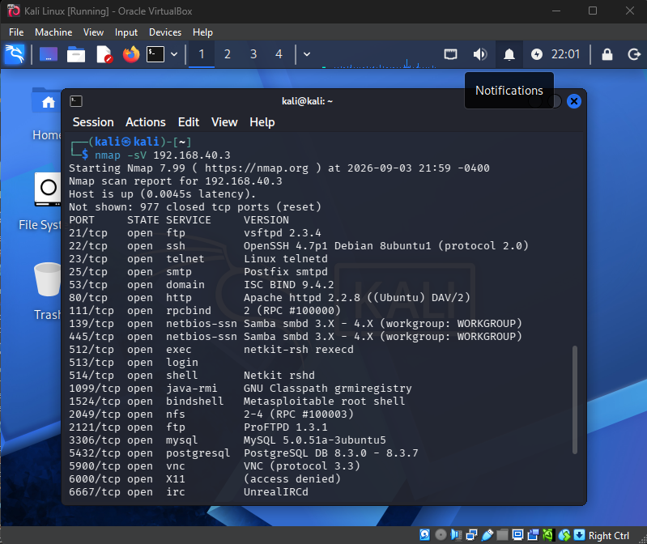

### 5. Searched Metasploit for a Matching Exploit
Launched `msfconsole` and ran `search vsftpd` which displays a list of all exploits available for this specific vulnerabilty. The exploit we will be using is `exploit/unix/ftp/vsftpd_234_backdoor`

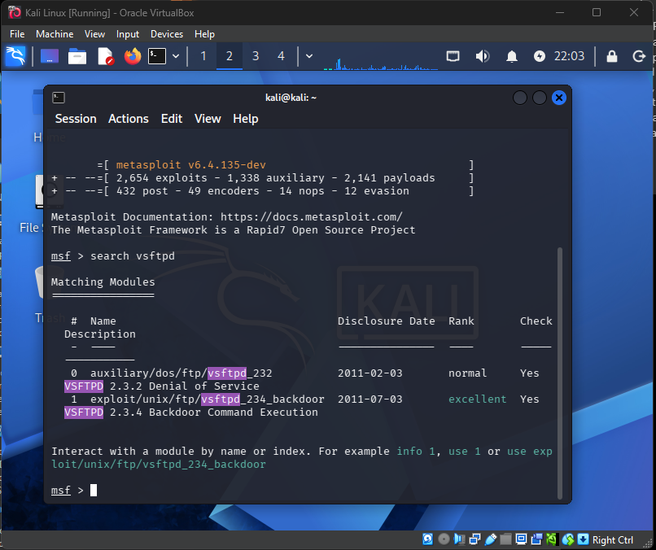

### 6. Select the Exploit Module
Ran `use exploit/unix/ftp/vsftpd_234_backdoor` to load the module, which automatically configured a default payload (cmd/linux/http/x86/meterpreter_reverse_tcp).

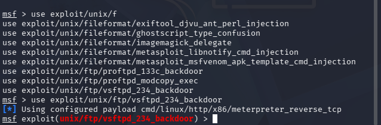

### 7. Configured Target and Local Host's
In order to execute the payload there are a couple of parameters we need to set. These can be seen using the `show options` command.

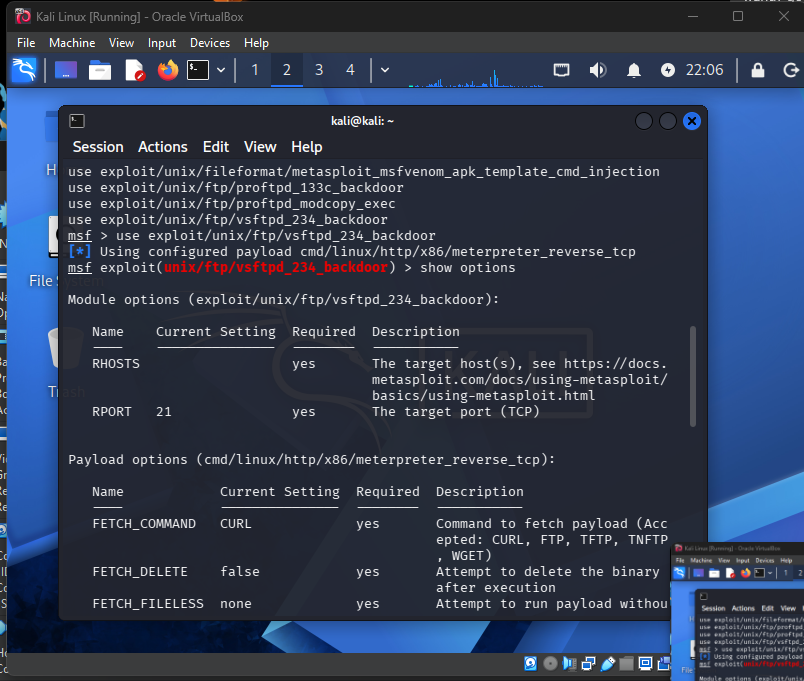

The first is `RHOSTS` which is used to set the IP address of the machine we want to target with the exploit (`192.168.40.3`) 

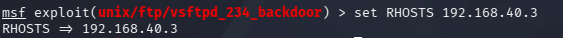

Next is `LHOST` (Local Host) which is the IP address of the attacking machine, our Kali VM (`192.168.40.4`). In this exploit it allows us to connect to the machine and control it through a reverse shell.

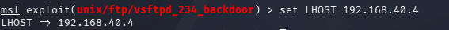

### 8. Ran the Exploit
Executed the exploit and opened a full Meterpreter session using a reverse TCP connection (our attacking machine listens on port 4444 and when the the exploit is ran on the target it forces it to reach out and connect giving us control). From there, sysinfo confirmed the compromised machine's details, and getuid confirmed the session was running as root (the highest possible privilege level).

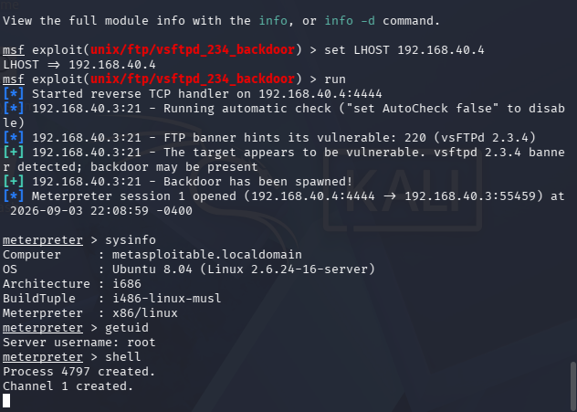

### 9. Extracted Password Hashes
Dropped into a full shell from meterpreter and ran `cat /etc/shadow`. Because we currently have root access we have the privileges needed to read the password hash file. Reading this file confirms full-system compromise.

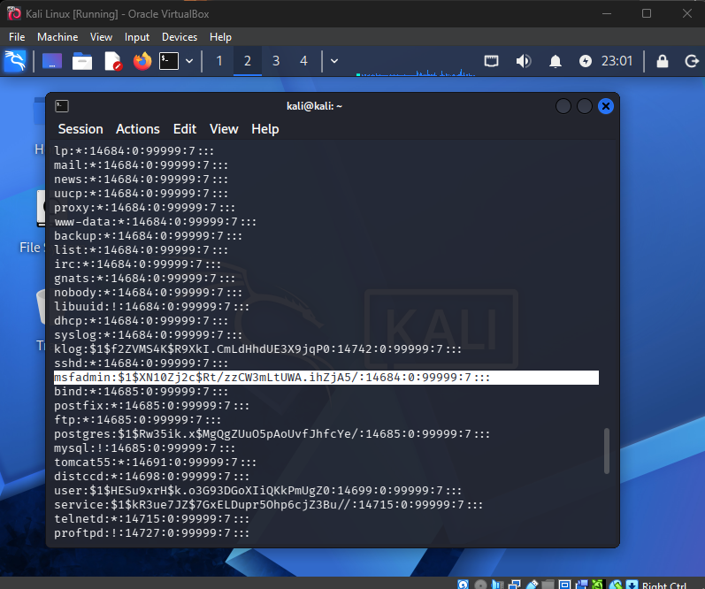

### 10. Attempt to Crack The Extracted Hash
For a simple demonstration we will use the `msfadmin` account to show the password cracking as it is a very simple password to crack.

I transferred the `msfadmin` password hash from the console to a text document using `nano hash.txt`

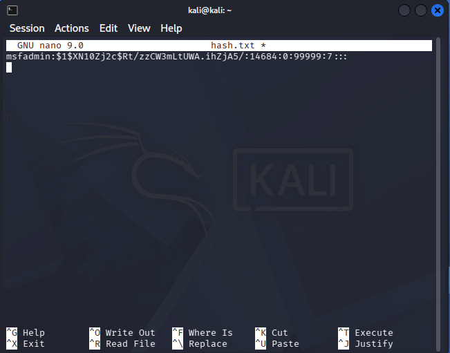

Using John the Ripper and the command `John hash.txt` we cracked the account password (`msfadmin`) extremely quickly using the default wordlist because it isn't very secure. In contrast, i used the same process against the root account's hash, and used both John the Rippers default wordlist and the full `rockyou.txt` list (14 million+ entries) with no match found. Demonstrating the difference between cracking a weak vs strong password.

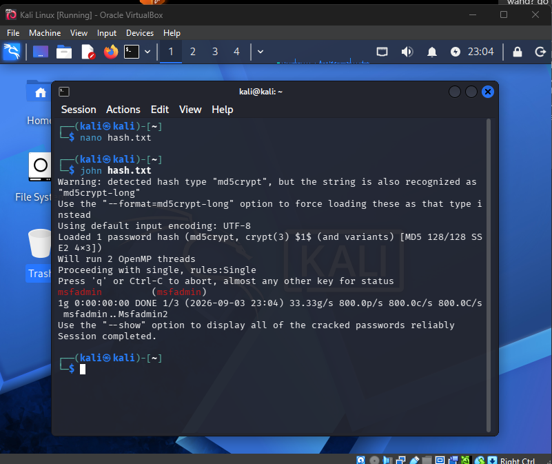

## Challenges & Troubleshooting
- After switching Kali's adapter to Host-only the interface failed to obtain an IP and stayed stuck negotiating DHCP. I resolved this by cycling the connection directly through NetworkManager using `sudo nmcli connection down "Wired connection 1"` followed by `sudo nmcli connection up "Wired connection 1"`

## Outcome
Successfully exploited the vulnerable machine through port 21 for ftp. Was able to connect via reverse shell, extract a chosen password has, and then crack it via John the Ripper revealing the plaintext password for that account.

## What I'd Do Next
- Practice privilege escalation techniques on a target where root isn't already handed to you by the initial exploit
- Explore additional Metasploitable2 vulnerabilities beyond vsftpd
